## Running project

1. เปิด terminal ทำการ clone project จาก github ลงเครื่อง

2. เข้าไปใน project Test-ttsolution

```bash
cd Test-ttsolution
```

3. install dependency ของ project ผ่าน npm ใช้เวลาสักครู่

```bash
npm install
```
4. หลังจาก install เสร็จ สั่ง run เพื่อทำการเปิด project ขึ้นมา
```bash
npm run dev
```

5. เปิด [http://localhost:3000](http://localhost:3000) สามารถใช้ Chrome หรือ edge

## Process behind

หลังจากที่ได้รับ requirement ตาม  google docs ที่ให้มาก็นำมาทำเป็น figma เพื่อให้เข้าใจก่อนว่าระบบต้องออกมาหน้าตาเป็นอย่างไร

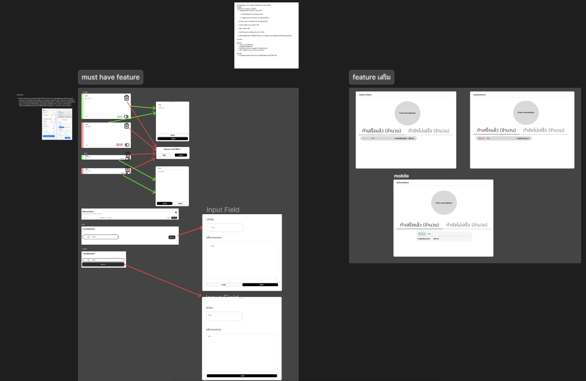

พอได้ design ของ UI มาแล้วก็เริ่มสร้าง project ขึ้นมา ใช้ Next js เพราะ มี App-route และ context ง่ายต่อการใช้งาน

### หน้าแรก Todo List
เมื่อเข้ามาจะ loading state และเรียก component `skeleton` ในระหว่างนั้น จะนำข้อมูลใน folder `mock` เข้าไปในตัวแปร tasks ที่เป็น `context`

- desktop
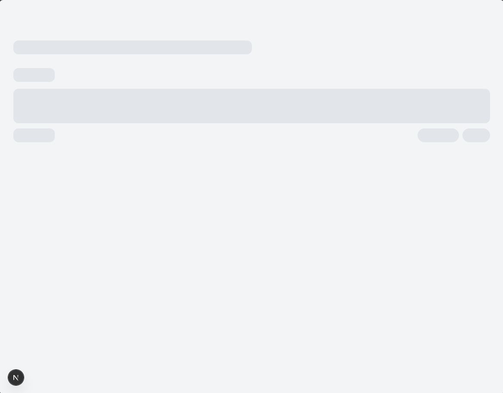

- mobile
<br/>

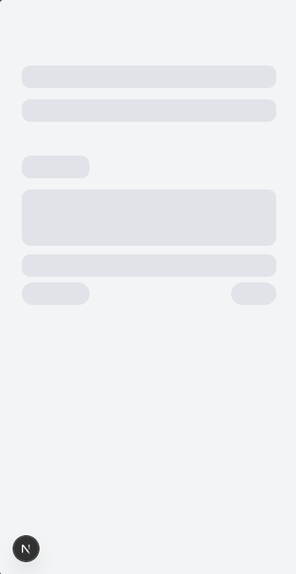

หลังจากที่ load ข้อมูลเสร็จ จะเป็นหน้า Todo List
- desktop
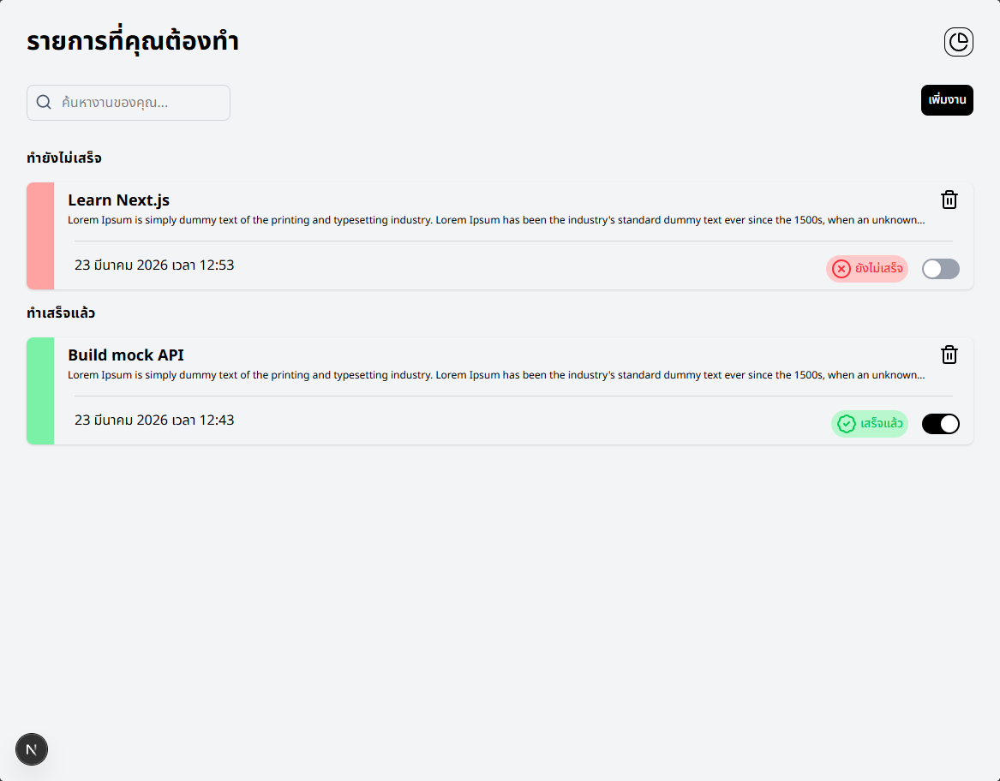

- mobile
<br/>
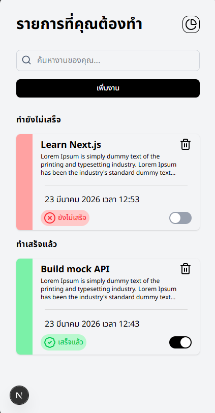

มีสามารถทำได้ดังนี้
- ค้นหา
- เพิ่มงาน
- แสดงรายละเอียด
- แก้ไขข้อมูล
- ลบข้อมูล
- ปรับสถานะ

เพิ่มเติม (feature เสริม)
- สรุปเวลาที่ใช้ในการทำ

### ค้นหา
ใช้งาน `filter` โดยค้นหาทั้ง title และ description ในตัวแปร tasks หลังจากค้นหาแล้วจะเก็บไว้ในตัวแปร `searchTodo` โดยเป็น `useMemo` ข้อดี คือ คำนวนเฉพาะตัวแปรที่ถูกแปรที่ถูกกำหนดไว้เท่านั้น

### กรณีที่หาไม่เจอ
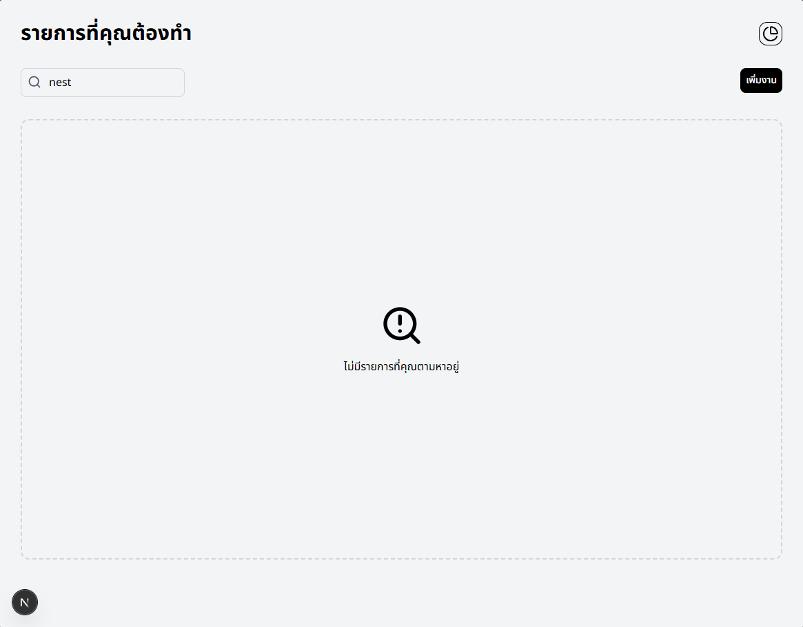

### เพิ่มงาน
ใน component `Button` จะเรียก function ใน Context `addTodo` หลังจากที่กรอกทั้ง title กับ description และ กดผ่านปุ่ม `บันทึก` ซึ่งใน function ใช้งาน `setTasks` เพิ่มในตัวแปร tasks
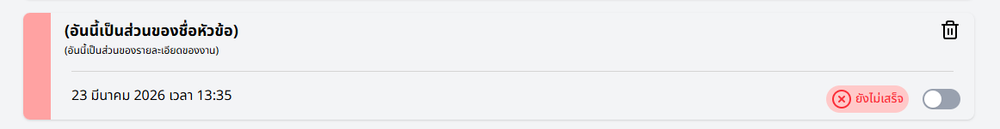

### กรณีที่ไม่ได้ใส่เนื้อหาเข้าไป
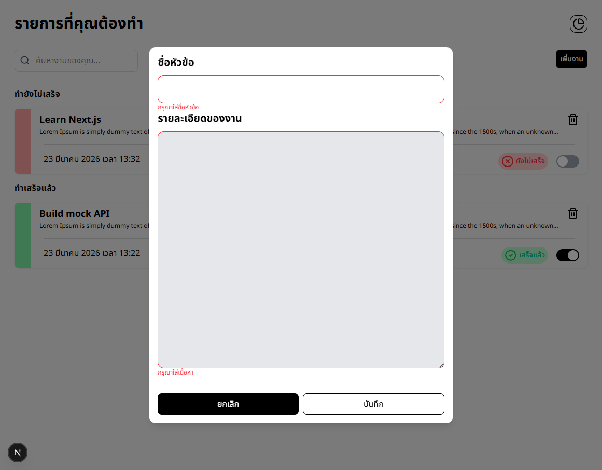

### แสดงรายละเอียด
ใน component `Card` จะมี
- ชื่อหัวข้อ
- เนื้อหา
- ปุ่มลบ (รูปถังขยะ)
- เวลาที่ถูกสร้างขึ้น
- Badge ที่แสดงให้เห็นชื่อของ สถานะ
- ปุ่ม toggle ที่สามารถปรับสถานะได้

สามารถกดตรงบริเวณ `หัวข้อ` หรือ `เนื้อหา` เพื่อแสดงรายละเอียดได้ โดยจะเรียก component `Dialog` ขึ้นมา การแสดงผลจะแตกต่างกันอยู่ 2 แบบ
- desktop จะค่อยๆขึ้นมาเป็น fade มาตรงกลางของหน้าจอ
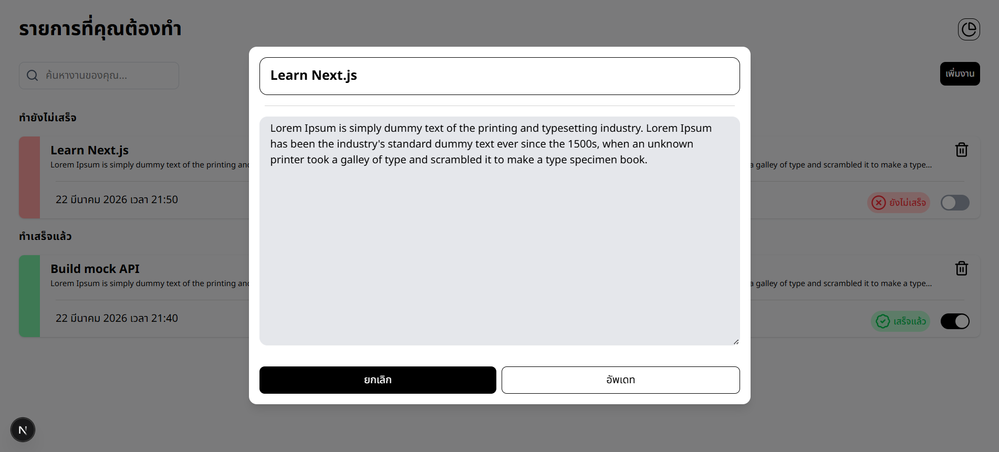

- mobile จะเลื่อนขึ้นมาจากด้านล่างของจอ
<br/>
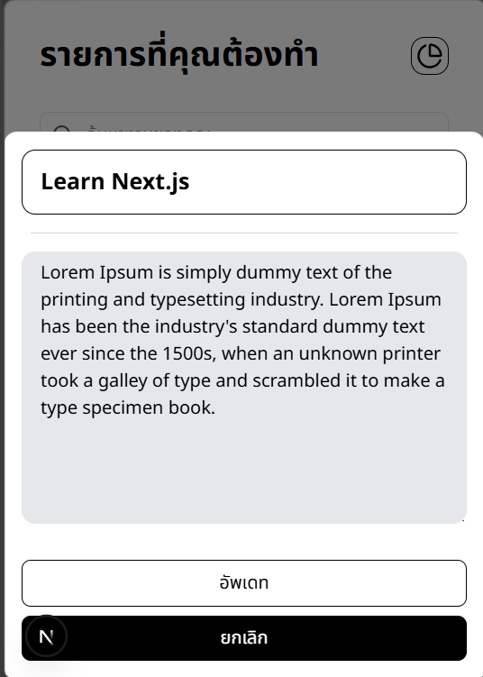

### แก้ไขข้อมูล
ใน component `Card` จะเรียก function ใน Context `editTodo` หลังจากที่แก้ title หรือ description และ กดผ่านปุ่ม `อัพเดท` ซึ่งใน function ใช้งาน `setTasks` แก้ไขในตัวแปร tasks
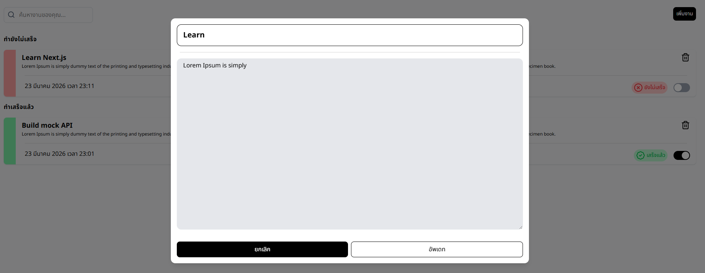
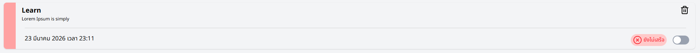

### ลบข้อมูล
ใน component `trash` จะเรียก function ใน Context `deleteTodo` เมื่อกดผ่านปุ่ม `ลบทิ้ง` ซึ่งใน function ใช้งาน `setTasks` ในนั้นจะมี filter ในตัวแปร tasks เอา `id` ที่จะถูกลบออกไป

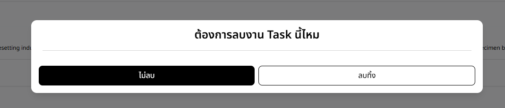

### กรณีลบข้อมูลทั้งหมด
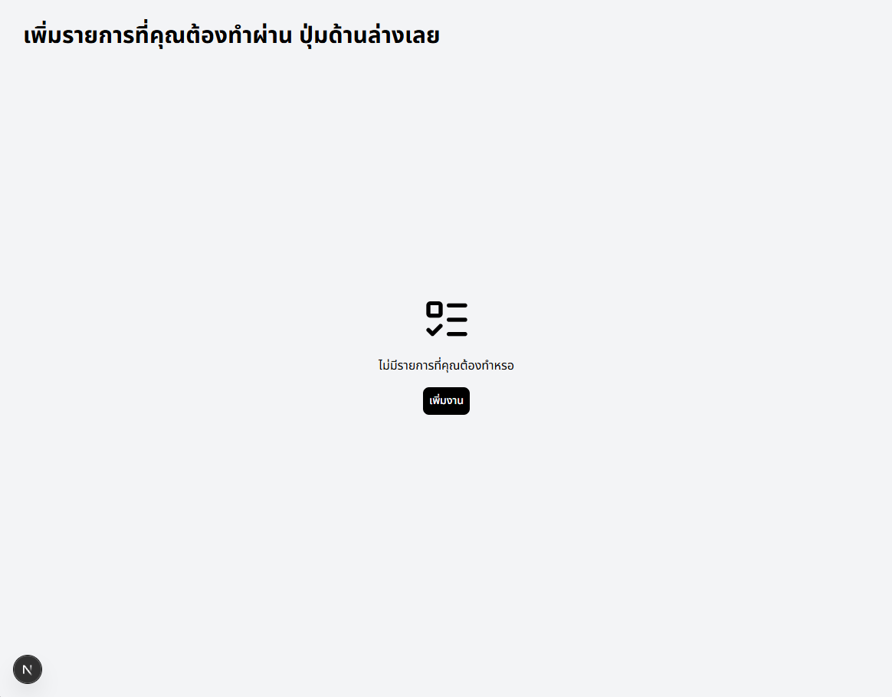

### ปรับสถานะ
ใน `Card` จะมีปุ่มให้กดแบบ toggle เมื่อกดแล้วจะเรียก function ใน Context `toggleTodo` ทำการบันทึกเวลาตอนที่กดลงไป ซึ่งการคำนวณระยะห่างของทั้ง 2 เวลาใช้ library `date-fns` มี function ในการเทียบเวลาแล้วเก็บค่าลง `finishTime` ในตัวแปร tasks

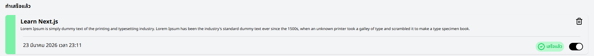

## เพิ่มเติม (feature เสริม)
### สรุปเวลาที่ใช้ในการทำ

โดยเสนอเป็น graph เพื่อให้เข้าใจได้ว่ายังเหลืองานหรือทำเสร็จหมด และ มี component `Tab` ให้สามารถเลือก `ทำเสร็จ` หรือ `ยังไม่เสร็จ` โดย `Tab` จะมีการใช้งาน context ข้อดี คือ เพื่อให้สามารถใช้งาน component ได้แบบ Headless ไม่จำเป็นต้องส่งอะไรเข้า component

- desktop
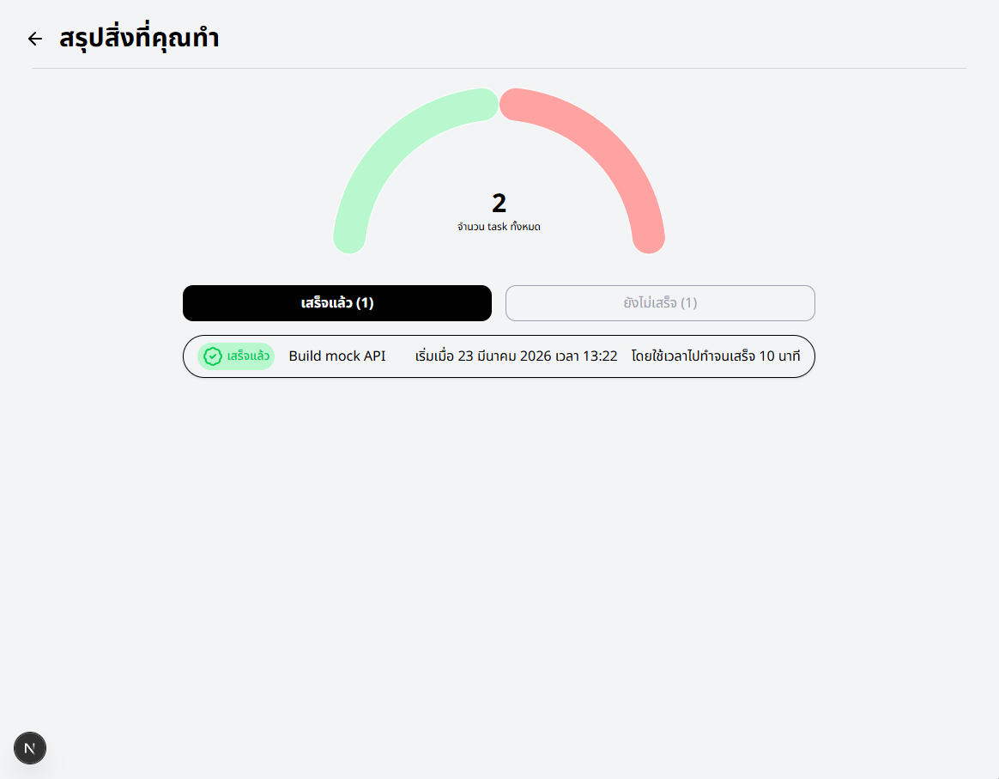
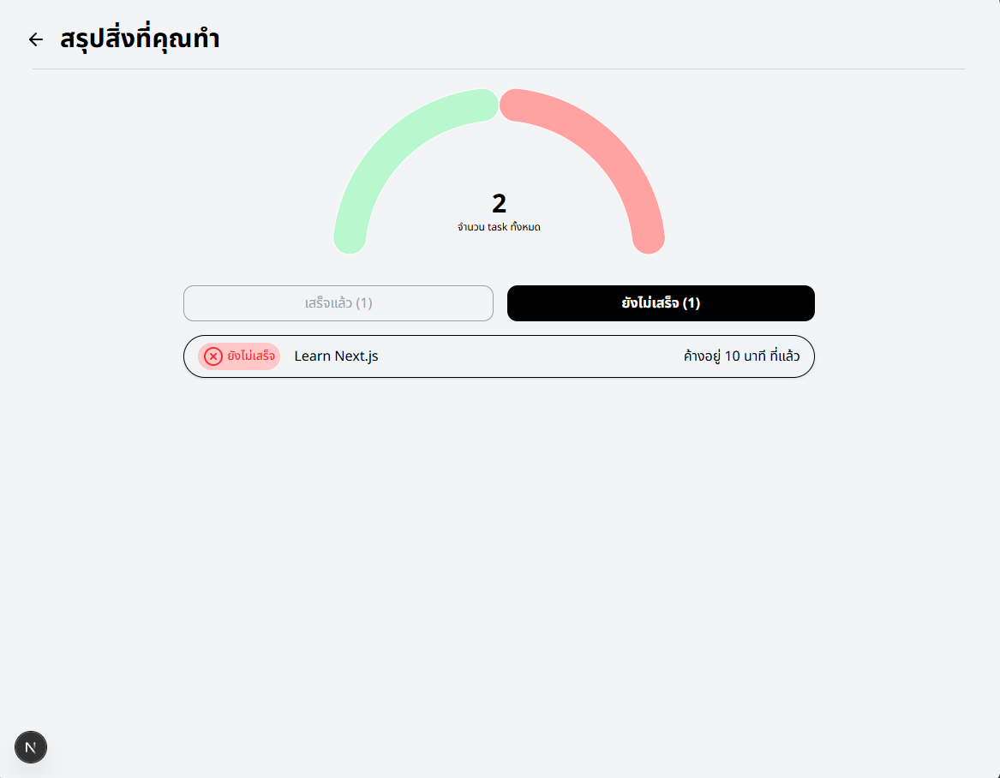

- mobile
<br/>
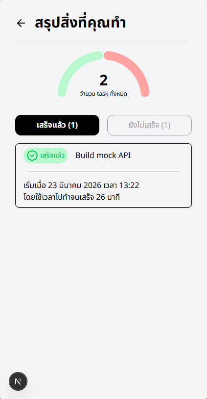
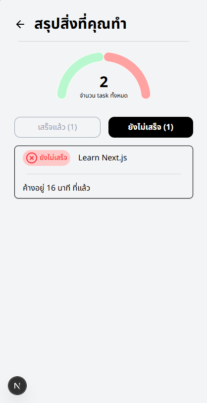

### กรณีที่มีทำหมดแล้ว
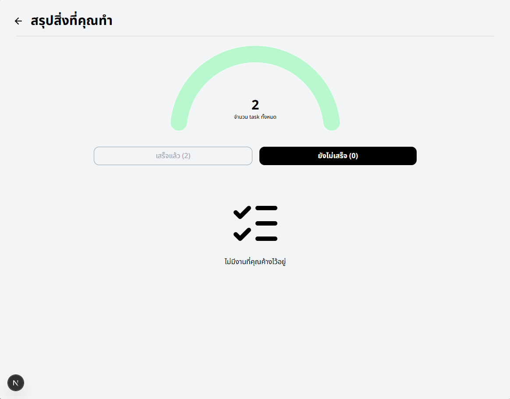

### กรณีที่ยังไม่ได้สักงาน
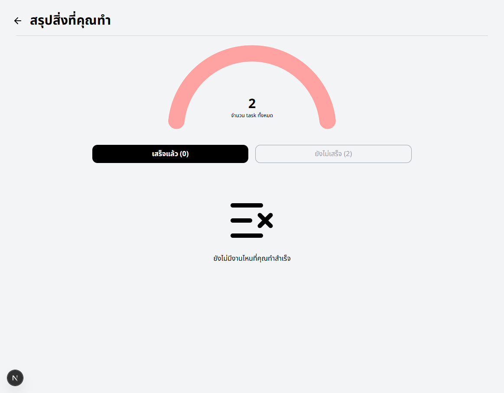